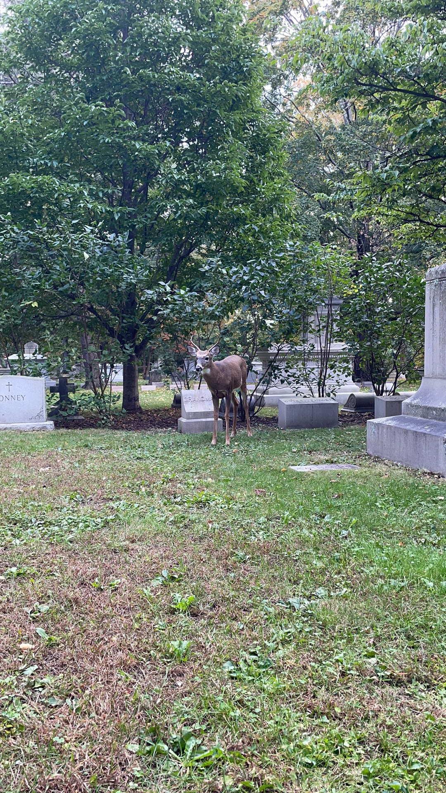

# 死亡

我有两次认真地思考死亡：一次是九岁那年得了肺炎，还有一次是半个月前连续三天的心悸（虽然后来确认是暂时的早搏）。我毫不怀疑我是个贪生怕死之辈，我只是想弄清我害怕的究竟是什么，或说死亡究竟是什么。

今天登奥本山公墓，去年的秋天登北京西山。见了若干墓碑，刻着红五星的、六芒星的、桂冠十字架的，赑屃驮的，约柜造型的，复刻斯芬克斯的，复刻各种方尖碑的。或新或旧，但终归于尘土。“嬴政梓棺费鲍鱼”， 而我们不知何为真正的永生。信教者执迷于来生或天堂，而红色圣愚强调伟大的事业——但相对于（仅限于我们所知的）宇宙来说，人类整体的命运又有几何？我们甚至不知时间为何物。

死后是什么样的我们一无所知，但我恐惧的是不能在死后有所感知。“驰骋畋猎令人心发狂”，但若心不发狂，我又怎知我心依然跳动？欲望若适当满足，则它是天使，而禁欲者为了逃脱永恒的审判而选择了自戕，正如走夜路的旅人为了摆脱被误认为魔鬼的影子而关闭了路灯。

每一次困顿都令我更加爱这个世界。生日这天神舟13号升空，不禁想到《光荣的领路人》，摘录歌词一段如下：

```
列宁的旗帜在我们上空飘扬
引领我们去建立幸福
我们用年轻的双手
去书写地球的传记
光荣啊，展望未来的人
我们从现在开始
走向辉煌的未来
我们的路--前往宇宙之路
我们在未来的岁月里
走上璀璨的道路
青年似那火箭
每日向前奋进
我们是曙光
我们将照耀祖国
光荣啊，展望未来的人
光荣啊，大步向前的人
我们从现在开始
走向辉煌的未来
```
最后来张照片，墓群中的小鹿：

